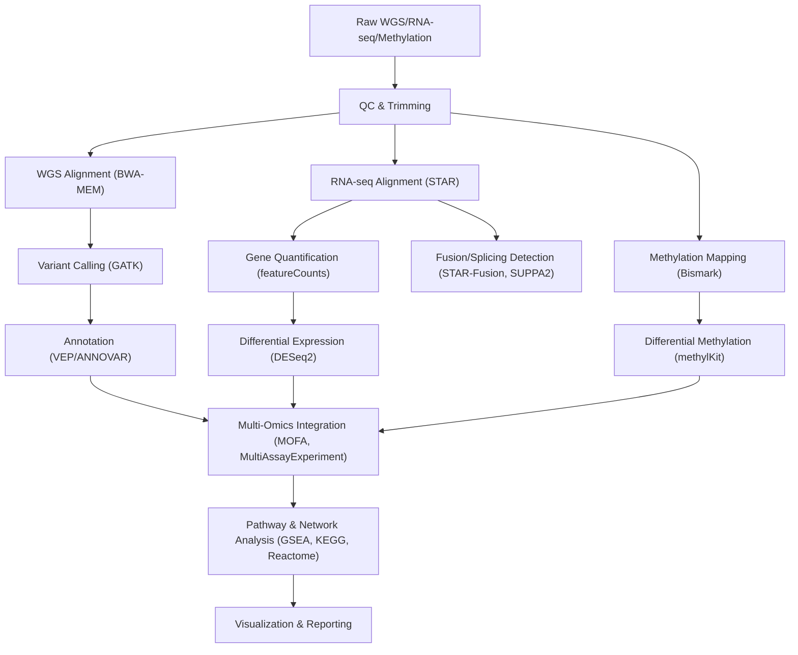

# 🧬 DS-AML Multi-Omics Analysis Pipeline

A fully reproducible, modular pipeline for integrative analysis of genome, transcriptome, and epigenome data in Down syndrome–associated acute megakaryoblastic leukemia (DS-AML) and related genetic disorders.

---

## 🌟 Overview

This repository provides an end-to-end workflow for analyzing and integrating whole-genome sequencing (WGS), RNA-seq, and (optionally) methylation or ATAC-seq data. The pipeline implements state-of-the-art tools for variant calling, expression analysis, gene fusion detection, and methylation profiling, followed by integrative analysis and network/pathway exploration.  
*While inspired by Ma et al. (Nature Genetics 2023), this pipeline is uniquely extensible to any syndrome-associated malignancy or rare disease.*

---

## 🚩 Motivation

Down syndrome–associated malignancies such as DS-AML exhibit unique genetic and epigenetic dysregulation. Integrative multi-omics analysis enables the discovery of regulatory networks and mutational drivers that traditional single-omics approaches may miss.  
This pipeline is designed to be flexible, reproducible, and easy to adapt for any rare disease or pediatric cancer genomics project.

---

## 🗂️ Directory Structure
```
ds-aml-pipeline/
├── data/ # Example/test FASTQ, BAM, VCF, counts, methylation (mock/simulated)
├── notebooks/ # Jupyter and R notebooks for QC, EDA, visualization
├── scripts/ # Core pipeline scripts (bash, Python, R)
├── workflow/ # Workflow manager (Snakemake/Nextflow) files
├── results/ # Example result tables and figures
├── docs/ # Methods, references, additional documentation
├── env/ # environment.yml and requirements.txt
├── LICENSE
└── README.md
```

---

## 🔬 Workflow Overview



---

## ⚙️ Key Features
Reproducible: Full pipeline from raw FASTQ/BAM to final figures and tables

Multi-Omics: Integrates genomics, transcriptomics, and epigenomics

Customizable: Easily switch reference, annotation, or focus genes for other syndromes or cancers

Algorithmic Strength: Employs best-practice and novel tools for fusion/splicing, multi-omics integration, and pathway mapping

Open Science: All code, methods, and mock data are open and ready to adapt

---

## 📝 How to Run

1. Clone this repo:

```
git clone https://github.com/yourusername/ds-aml-pipeline.git
cd ds-aml-pipeline
```

2. Install Dependencies: 

```
conda env create -f env/environment.yml
conda activate dsaml_env
```


3. Configure the pipeline:


```
    Edit workflow/config.yaml with your paths and parameters
```


4. Run the pipeline:

```
    snakemake --cores 8 --use-conda
```

5. Explore results:

    See /results/ for tables, plots, and summary files

    Use provided Jupyter or R notebooks in /notebooks/ for EDA, clustering, and visualization

---

## 📊 Sample Data and Results
Mock data and output tables are included for full reproducibility and demonstration.
Example input/output files:

/data/mock_wgs.fastq, /data/mock_rnaseq.fastq, /data/mock_methyl.bam

/results/sample_variants.vcf, /results/sample_counts.txt, /results/sample_DMRs.csv, /results/sample_network.png

See the /notebooks/ folder for walkthroughs of analysis and visualization.

--- 

## 🔁 Reproducibility
Sample data: All pipelines can be run end-to-end using the provided mock datasets in '/data/'

Environment management: All requirements specified in /env/environment.yml for easy setup

Stepwise documentation: Each module and notebook contains clear explanations

License: Distributed under the MIT License for broad use and adaptation

---

## 💡 Novel Extensions
Down syndrome–specific driver panel for rapid variant prioritization

Rare fusion/splicing detection (SUPPA2, MAJIQ modules)

Optional ATAC-seq/ChIP-seq integration for regulatory discovery

Interactive dashboard (Dash or Shiny) for real-time exploration


---

## 📚 Documentation
Methods and references: docs/methods.md

Example config and workflow: workflow/

Scripts and notebooks: scripts/, notebooks/
